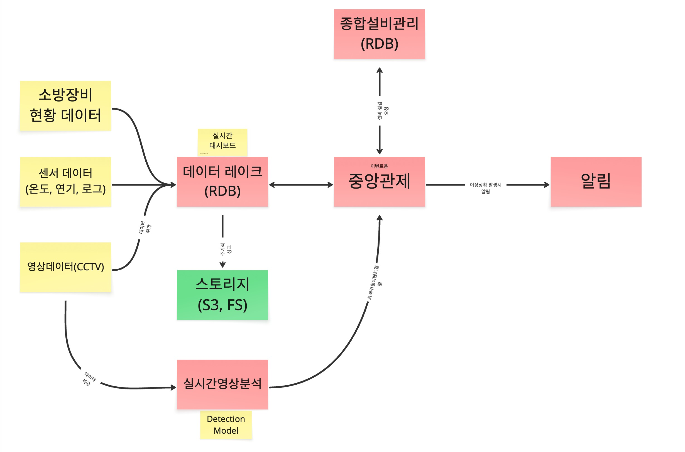
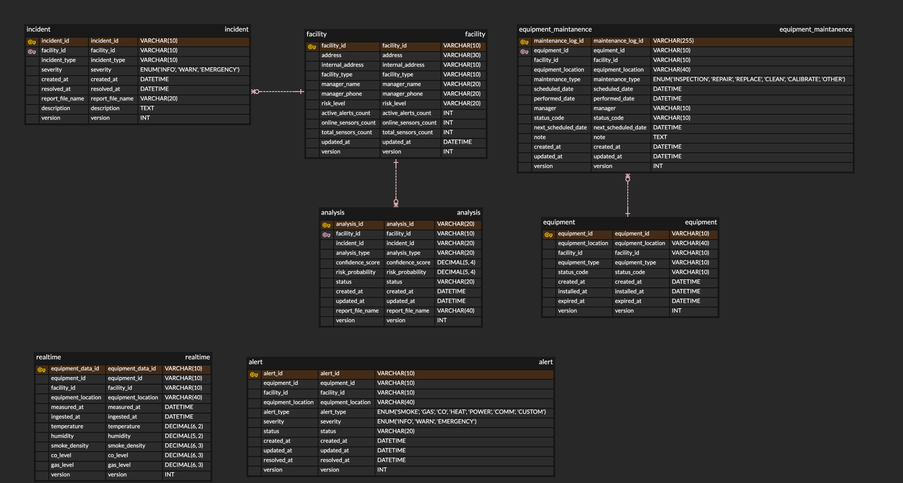

# Fire IoT MSA

IoT 화재 모니터링 시스템으로 실시간 데이터 처리 및 알림 기능을 제공합니다.

## 서비스 링크

### 핵심 서비스

- **[DataLake](./services/datalake/README.md)** - 센서 데이터 수집, 문제 탐지, 대시보드 제공

  - **API 서비스**: 포트 8084 - 메인 데이터 처리 및 저장 서비스
  - **대시보드**: 포트 8501 - Streamlit 기반 실시간 모니터링 대시보드
  - **기술**: Python, FastAPI, PostgreSQL, Redis, Kafka
  - **기능**: 실시간 센서 데이터 처리, 이상치 탐지, 데이터 저장, 대시보드 시각화

- **[ControlTower](./services/controltower/README.md)** - 다른 서비스에 데이터를 제공하는 메인 서비스

  - **포트**: 8082
  - **기술**: Java, Spring Boot
  - **기능**: 중앙 데이터 분배, 서비스 오케스트레이션, Kafka 메시지 라우팅

- **[FacilityManagement](./services/facilitymanagement/README.md)** - 장비 및 유지보수 정보 관리

  - **포트**: 8083
  - **기술**: Java, Spring Boot, PostgreSQL
  - **기능**: 장비 관리, 유지보수 스케줄링, 시설 정보

- **[Alert](./services/alert/README.md)** - 문제 발견 시 알림 발송

  - **포트**: 외부 포트 없음 (내부 서비스)
  - **기술**: Python, Kafka consumer, Redis, Slack 연동
  - **기능**: 실시간 알림 처리, Slack 알림, 알림 중복 제거

- **[VideoAnalysis](./services/videoanalysis/README.md)** - AI 기반 화재 감지를 위한 비디오 분석

  - **포트**: 8085
  - **기술**: Python, Azure Computer Vision, OpenCV
  - **기능**: 실시간 비디오 분석, 화재 감지, 프레임 처리, Kafka 연동

- **[MockServer](./services/mock-server/README.md)** - 테스트용 가짜 데이터 생성

  - **포트**: 8001
  - **기술**: Java, Spring Boot
  - **기능**: 센서 데이터 시뮬레이션, CCTV 스트리밍 시뮬레이션, 테스트 데이터 생성

### 인프라 서비스

- **PostgreSQL DataLake**: 포트 5433 - 메인 센서 데이터 저장소
- **PostgreSQL FacilityManagement**: 포트 5435 - 장비 및 유지보수 데이터
- **Redis**: 포트 6379 - 캐싱 및 알림 중복 제거
- **Kafka**: 포트 9092 - 서비스 간 통신을 위한 메시지 브로커
- **Zookeeper**: 포트 2181 - Kafka 클러스터 조정
- **Kafka UI**: 포트 8090 - Kafka 관리 인터페이스
- **PgAdmin**: 포트 8091 - 데이터베이스 관리 인터페이스

## 아키텍처 다이어그램



## ADR (아키텍처 결정 기록)

### ADR-001: 서비스 간 통신에 Kafka 사용

- **문제**: 서비스들이 서로 통신해야 함
- **결정**: 서비스 간 메시지 전달에 Kafka 사용
- **이유**: Kafka는 Azure Event Hub와 원활한 통합을 제공합니다.

### ADR-002: 서비스별 데이터베이스 분리

- **문제**: 각 서비스의 데이터를 어디에 저장할지
- **결정**: 각 서비스가 필요시 자체 PostgreSQL 데이터베이스 보유
- **이유**: 서비스가 다른 서비스에 영향을 주지 않고 데이터를 변경할 수 있음

### ADR-003: 이벤트 기반 통신을 통한 마이크로서비스 아키텍처

- **문제**: 확장 가능하고 유지보수가 용이한 시스템 아키텍처 필요
- **결정**: Kafka 기반 이벤트 스트리밍을 통한 MSA 구현
- **이유**: 독립적인 서비스 개발, 배포 및 확장 가능

## 데이터 아키텍처



### 데이터베이스 테이블 (PostgreSQL)

**DataLake 데이터베이스:**

```
realtime
- id (PK)
- equipment_id
- facility_id
- temperature, humidity, smoke_density, co_level, gas_level
- measured_at
- created_at

alert
- id (PK)
- equipment_id
- alert_type (WARNING, EMERGENCY)
- message
- created_at
```

**FacilityManagement 데이터베이스:**

```
equipment
- id (PK)
- name, type, location
- status (ACTIVE, INACTIVE, MAINTENANCE)
- created_at

maintenance
- id (PK)
- equipment_id (FK)
- type, description
- scheduled_date, completed_date
- status (SCHEDULED, IN_PROGRESS, COMPLETED)
```

### Kafka 토픽

```
dataLake.sensorDataAnomalyDetected
- equipment_id, facility_id, alert_type, message, timestamp

dataLake.sensorDataSaved
- equipment_id, facility_id, data, timestamp

controlTower.warningAlertIssued
- alert_id, message, severity, timestamp

controlTower.emergencyAlertIssued
- alert_id, message, severity, timestamp

alert.alertSendSuccess
- alert_id, message, timestamp

alert.alertSendFail
- alert_id, message, severity, timestamp
```

## 에러 처리

### 전략 1: 단순 재시도

- 서비스 호출이 실패하면 3번까지 재시도
- 재시도 간 1초 대기
- 여전히 실패하면 에러 로그 기록 후 중단

### 전략 2: 서킷 브레이커

- 1분 내에 서비스가 5번 실패하면 30초간 시도 중단
- 서비스가 복구될 때까지 기다린 후 다시 시도
- 시스템 과부하 방지

### 구현 예시

### 헬스 체크

각 서비스는 `/healthz` 엔드포인트를 가짐:

```
GET /healthz
Response: {"status": "healthy", "timestamp": "2024-01-01T12:00:00Z"}
```

### 에러 로깅

- 모든 에러는 타임스탬프와 서비스명과 함께 로그 기록
- 중요한 에러는 모니터링 시스템으로 전송
- 데이터베이스 연결 에러는 재시도 트리거

## MSA 보드

### 서비스 의존성

```
DataLake가 필요로 하는 것:
- PostgreSQL (데이터 저장)
- Redis (캐시)
- Kafka (메시지 전송)
- Mock Server (데이터 수집)

ControlTower가 필요로 하는 것:
- Kafka (메시지 수신)
- 데이터베이스 없음 (읽기 전용)

FacilityManagement가 필요로 하는 것:
- PostgreSQL (장비 데이터 저장)

Alert가 필요로 하는 것:
- Kafka (메시지 수신)
- Redis (중복 제거)
- Slack (알림 발송)

VideoAnalysis가 필요로 하는 것:
- Kafka (분석 결과 전송)
- Mock Server (비디오 스트림 수집)
- Azure Computer Vision API

Mock Server가 필요로 하는 것:
- 없음 (독립 실행)
```

### 통신 패턴

```
DataLake → Kafka → ControlTower (센서 데이터)
DataLake → Kafka → Alert (이상치 알림)
ControlTower → Kafka → Alert (경고/긴급 알림)
VideoAnalysis → Kafka → Alert (화재 감지 알림)
FacilityManagement → Kafka → Alert (유지보수 알림)
```

## 빠른 시작

### 모든 서비스 시작

```bash
docker-compose up -d
```

### 상태 확인

```bash
docker-compose ps
```

### 접속 지점

- **DataLake 대시보드**: http://localhost:8501
- **DataLake API**: http://localhost:8084
- **ControlTower API**: http://localhost:8082
- **FacilityManagement API**: http://localhost:8083
- **VideoAnalysis 서비스**: http://localhost:8085
- **Mock Server**: http://localhost:8001
- **Kafka UI**: http://localhost:8090
- **PgAdmin**: http://localhost:8091

### 모든 서비스 중지

```bash
docker-compose down
```

## 개발

### 서비스 빌드

```bash
# 모든 서비스 빌드
docker-compose build

# 특정 서비스 빌드
docker-compose build datalake
docker-compose build controltower
docker-compose build facilitymanagement
docker-compose build alert
docker-compose build videoanalysis
docker-compose build mock-server
```

### 로컬 개발

```bash
# DataLake API
cd services/datalake
python -m uvicorn app.main:app --reload --port 8084

# DataLake 대시보드
cd services/datalake
streamlit run run_dashboard.py --server.port 8501

# ControlTower
cd services/controltower
./mvnw spring-boot:run

# FacilityManagement
cd services/facilitymanagement
./mvnw spring-boot:run

# Alert 서비스
cd services/alert
python -m uvicorn app.main:app --reload

# VideoAnalysis
cd services/videoanalysis
python main.py

# Mock Server
cd services/mock-server
./mvnw spring-boot:run
```

## 서비스 헬스 모니터링

### 헬스체크 엔드포인트

- **DataLake API**: `http://localhost:8084/healthz`
- **ControlTower**: `http://localhost:8082/healthz`
- **FacilityManagement**: `http://localhost:8083/healthz`
- **VideoAnalysis**: `http://localhost:8085/healthz`
- **Mock Server**: `http://localhost:8001/healthz`

### 모니터링 명령어

```bash
# 모든 서비스 상태 확인
docker-compose ps

# 서비스 로그 보기
docker-compose logs -f [서비스명]

# 특정 서비스 헬스체크
curl http://localhost:8084/healthz
curl http://localhost:8082/healthz
curl http://localhost:8083/healthz
curl http://localhost:8085/healthz
curl http://localhost:8001/healthz
```

## 배포

### 로컬

```bash
docker-compose up -d
```

### Azure

```bash
cd infra/aca
./deploy.sh
```

## 기술 스택

### 백엔드 서비스

- **Python**: DataLake, Alert, VideoAnalysis
- **Java**: ControlTower, FacilityManagement, MockServer
- **프레임워크**: FastAPI, Spring Boot, Streamlit

### 인프라

- **메시지 브로커**: Apache Kafka
- **데이터베이스**: PostgreSQL (다중 인스턴스)
- **캐시**: Redis
- **컨테이너화**: Docker, Docker Compose

### 외부 서비스

- **Azure Computer Vision**: 비디오 분석 및 화재 감지
- **Slack**: 알림 발송
- **Azure Event Hub**: 프로덕션 메시지 스트리밍 (계획됨)

## 기여하기

1. 저장소를 포크합니다
2. 기능 브랜치를 생성합니다
3. 변경사항을 만듭니다
4. 적용 가능한 경우 테스트를 추가합니다
5. 풀 리퀘스트를 제출합니다


## 개선할 점
1. 중앙 관제 센터 장애 대응 로직 추가
2. 스토리지 오토 스케일링 및 분산 저장
3. 통합 테스트 시나리오 작성

## 라이선스

이 프로젝트는 MIT 라이선스 하에 있습니다.
